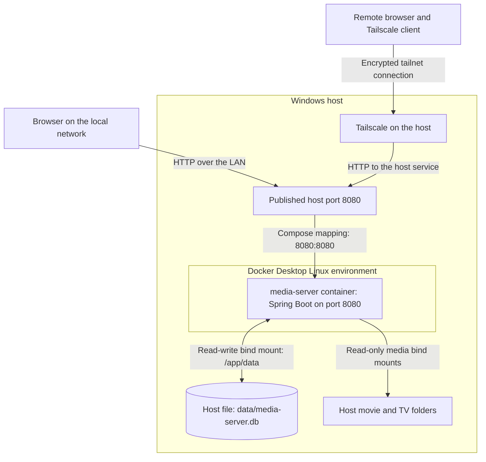
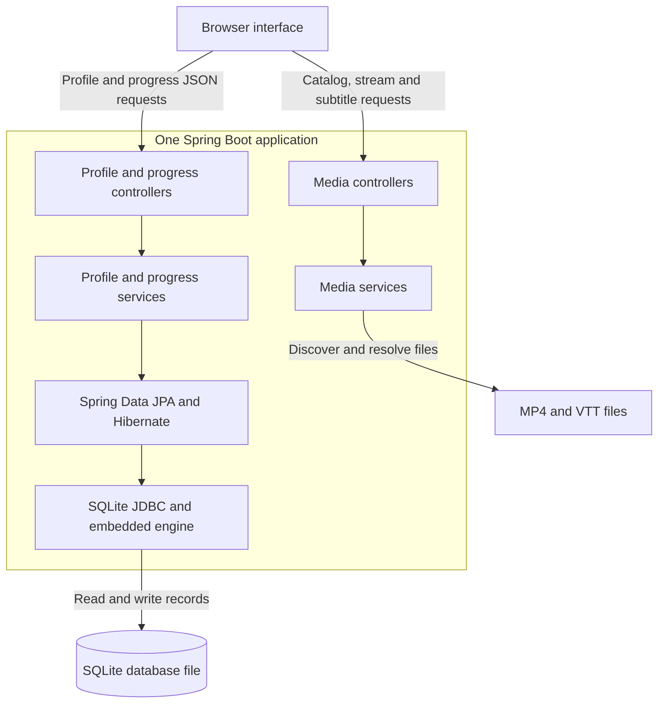
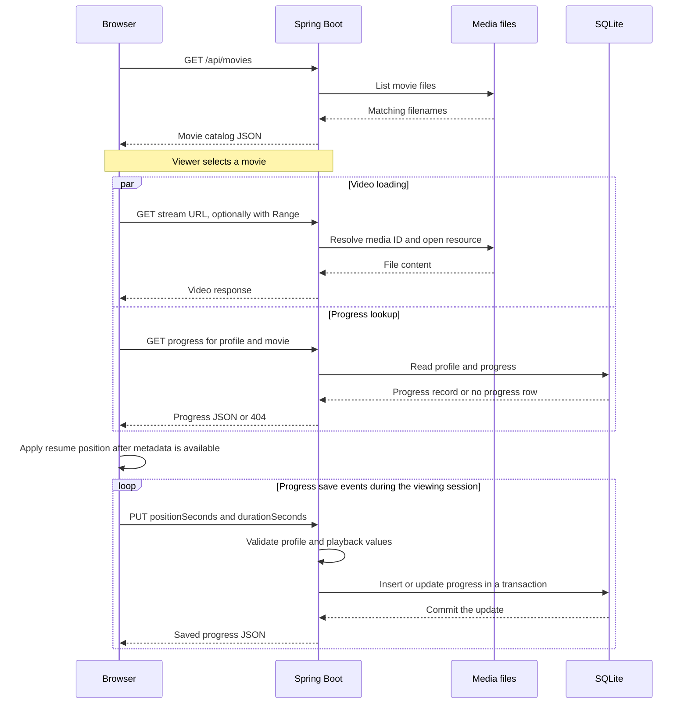
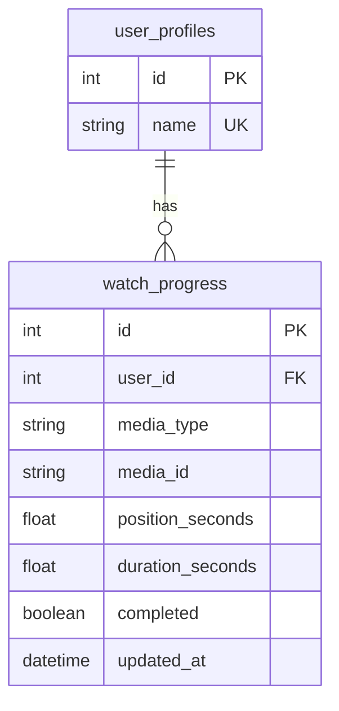

# Local Media Server

## Project description

Local Media Server is a Java 21 and Spring Boot application that lets users browse and stream movies and TV episodes from a Windows PC through a web browser. Its HTML, CSS, and JavaScript interface supports MP4 playback, optional WebVTT subtitles, selectable profiles, and playback progress stored in SQLite.

The application runs as one Spring Boot process, either directly on the host or inside a Docker Compose service. In the Docker deployment, media folders are mounted read-only and the SQLite database is stored in a writable host folder, preserving profiles and progress when the container is recreated. Optional Tailscale access connects remote devices to the host through a private, encrypted network.

**Technology stack:** Java 21 · Spring Boot / Spring MVC · Spring Data JPA / Hibernate · SQLite · Docker Compose · HTML / CSS / JavaScript · Tailscale

For installation and startup commands, see [README.md](README.md).

## 1. System architecture

The deployed system has three main responsibilities: the browser presents and plays media, the Spring Boot application handles requests, and host storage retains media and application data.



**How to read the diagram:**

1. A LAN client connects to the Windows host's IP address on port `8080`.
2. Docker publishes the container's port `8080` through the same port on the host.
3. The Spring Boot application serves the browser interface, JSON APIs, video resources, and subtitles.
4. SQLite runs within the application process and accesses the mounted database file. The cylinder represents that file on the host.
5. Video and subtitle files stay in the host's media folders. The container reads those folders through bind mounts.
6. A remote Tailscale client reaches the host through the optional encrypted network path. The Tailscale agent runs on the Windows host in this deployment.

This is a single application deployment with an embedded database. Docker Desktop supplies the Linux environment that runs the container; the browser runs on the viewing device.

## 2. Application components

These are logical responsibilities within the same application, rather than separately deployed services.

| Component | Responsibility |
| --- | --- |
| Browser interface | Renders movie and show lists, filters titles, manages profile selection, and controls the HTML video player. |
| Media controllers | Expose catalog, episode, streaming, and subtitle routes through Spring MVC. |
| Media services | Discover media in the configured directories and resolve media identifiers to files. |
| Profile service | Validates profile names and creates, lists, or deletes profiles. |
| Progress service | Loads and saves playback position for a particular profile and media item. |
| Spring Data JPA and Hibernate | Map profile and progress entities to relational records and execute repository operations. |
| SQLite JDBC driver | Connects the application to the SQLite database file. |
| Docker Compose | Defines the application container, environment settings, port publishing, storage mounts, and restart policy. |



The diagram shows the main dependency paths. After a media service resolves a file, the controller returns a file resource that Spring MVC writes to the HTTP response.

The database holds profile and progress records. Media discovery operates on the filesystem, so video files are not inserted into SQLite. In the reviewed movie service, listing or resolving a movie scans the configured movie directory. The frontend also keeps an in-memory cache of episode lists already opened in that browser page.

## 3. Playback and request flow

The following sequence illustrates movie playback with an existing selected profile. Video loading and the saved-progress lookup can overlap; the browser waits for video metadata before applying a resume position. Optional subtitle requests are omitted from this sequence for clarity.



SQLite interactions in this sequence represent embedded database operations through JPA and JDBC, not network requests to another database service.

### Serving video

The movie and episode controllers return a `FileSystemResource` through `ResponseEntity<Resource>` with the `video/mp4` content type. The browser's video element requests the media URL and handles playback.

Spring MVC provides HTTP byte-range handling for this resource response pattern. That lets a compatible browser request sections of a file when loading or seeking. This behavior comes from the framework's resource handling; the reviewed controllers do not implement a custom chunking protocol. See [Spring MVC range requests](https://docs.spring.io/spring-framework/reference/web/webmvc/mvc-range.html).

The reviewed media endpoints serve existing files without a transcoding stage. Playback therefore depends on the viewing browser supporting the audio and video codecs inside the MP4 file.

### Loading subtitles

The frontend checks the selected title's subtitle endpoint with a `HEAD` request. If subtitles are available, it adds a subtitle track to the video element. The controller serves WebVTT using `text/vtt;charset=UTF-8`; a missing subtitle returns `404` and the frontend continues without subtitles.

For movies, the reviewed service looks for a `.vtt` file beside the video with the same base filename. The documented media layout follows that naming convention for episodes as well.

### Saving and restoring progress

- The browser remembers the selected profile ID in `localStorage`. Playback progress is saved on the server in SQLite.
- During playback, `timeupdate` events trigger save attempts at roughly five-second intervals. These are event-driven attempts, not a guaranteed timer or delivery interval.
- Additional save attempts occur on pause, playback end, page visibility changes, page exit, and before switching profiles or titles.
- The frontend submits the playback position and duration in seconds. Saves require a selected profile, valid media state, and playback that has started.
- The backend checks that the profile exists, the media type is supported, the media ID is nonblank and within its length limit, and playback values are finite and valid. Negative positions and nonpositive durations are rejected.
- The entity caps the saved position at the duration and marks the record complete when the position reaches at least **95%** of that duration. Seeking near the end can therefore mark a title complete.
- When reopening a title, the frontend restores an unfinished position. A completed record, no progress record, or a position within five seconds of the video's end causes playback to start from the beginning.

Playback can also run without a selected profile, in which case progress is not saved. Page-exit saves are best-effort; a sudden disconnect can lose the most recent unsaved position.

## 4. Database design

The schema contains two application tables. The diagram uses logical field types; the SQL schema defines the actual SQLite column declarations.



| Record | Meaning |
| --- | --- |
| `user_profiles` | A selectable profile with a generated ID and a unique name. Application validation trims names, rejects blank names, limits them to 50 characters, and checks duplicates without regard to case. |
| `watch_progress` | The latest saved position, duration, completion flag, and update time for one profile and one media item. |

The unique constraint on **`(user_id, media_type, media_id)`** permits one progress row for that combination. Subsequent saves update that row. A different profile gets its own row for the same title. This records the latest position rather than a history of every playback event.

`user_id` references a profile. `media_type` distinguishes `MOVIE` from `EPISODE`; the API accepts these names without regard to case. `media_id` is an application identifier returned by the media catalog, with no database foreign key to a media table.

The reviewed movie service derives movie IDs from lowercased filenames. Renaming a movie beyond a case-only change produces a different identifier, so its previous progress does not automatically follow the new name.

When a profile is deleted, the profile service explicitly deletes its progress records and then the profile inside a transaction. This behavior is implemented in the service; the supplied SQLite schema does not specify an `ON DELETE CASCADE` rule.

### SQLite initialization

The tested configuration uses the SQLite JDBC driver and Hibernate's community `SQLiteDialect`. Spring Boot runs `schema-sqlite.sql` at startup with `spring.sql.init.mode=always`, while `spring.jpa.hibernate.ddl-auto=none` leaves table creation to the SQL script.

The script uses `CREATE TABLE IF NOT EXISTS`, preserving existing tables and records during normal startup. It creates missing tables but does not migrate an existing table to a new structure. This follows Spring Boot's [SQL initialization mechanism](https://docs.spring.io/spring-boot/how-to/data-initialization.html).

The JDBC configuration enables foreign keys and sets a busy timeout of 5,000 milliseconds. The configured Hikari connection pool is limited to one connection. SQLite's embedded model fits this single-host deployment; write concurrency and workload requirements would need reassessment before expanding its scale. See [SQLite's deployment guidance](https://www.sqlite.org/whentouse.html).

## 5. HTTP API

These routes are present in the reviewed controllers. Catalog, profile, and progress endpoints exchange JSON; streaming and subtitle endpoints return media resources.

| Method | Route | Purpose |
| --- | --- | --- |
| `GET` | `/api/movies` | List movies. |
| `GET` | `/api/movies/{id}/stream` | Serve a movie resource. |
| `GET` | `/api/movies/{id}/subtitles` | Serve movie subtitles when available. |
| `GET` | `/api/shows` | List shows. |
| `GET` | `/api/shows/{showId}/episodes` | List episodes for a show. |
| `GET` | `/api/shows/episodes/{episodeId}/stream` | Serve an episode resource. |
| `GET` | `/api/shows/episodes/{episodeId}/subtitles` | Serve episode subtitles when available. |
| `GET` | `/api/users` | List profiles. |
| `POST` | `/api/users` | Create a profile from a JSON `name` field. |
| `DELETE` | `/api/users/{id}` | Delete a profile and its saved progress. |
| `GET` | `/api/progress/{userId}` | List the profile's progress, newest update first. |
| `GET` | `/api/progress/{userId}/{mediaType}/{mediaId}` | Retrieve progress for one title. |
| `PUT` | `/api/progress/{userId}/{mediaType}/{mediaId}` | Create or update progress for one title. |

Example progress request body:

```json
{
  "positionSeconds": 120,
  "durationSeconds": 3600
}
```

The server calculates `completed` and `updatedAt`. Profile selection supplies the `userId` in the request path; it does not establish an authenticated session.

## 6. Docker deployment and storage

The Compose configuration defines one service, `media-server`. It packages the application with a Java 21 runtime and publishes `8080:8080`.

| Host location | Container location | Access and purpose |
| --- | --- | --- |
| Project `./data` directory | `/app/data` | Read/write; contains `media-server.db`. |
| `C:/media-library/movies` | `/media/movies` | Read-only; movie files and optional subtitles. |
| `C:/media-library/shows` | `/media/shows` | Read-only; show directories, episodes, and optional subtitles. |

These are **bind mounts** that connect existing host paths to container paths. The media library is kept outside the application image, and database writes reach the host's data folder. Replacing the container retains that folder's contents. Docker documents this behavior under [bind mounts](https://docs.docker.com/engine/storage/bind-mounts/).

The build and startup sequence is:

1. The Maven wrapper builds the executable application JAR on the host.
2. The Dockerfile uses `eclipse-temurin:21-jre`, copies the JAR from `target/` to `/app/app.jar`, and starts it with `java -jar app.jar`.
3. Compose provides container media paths and the SQLite database URL through environment settings.
4. Spring Boot initializes the database schema and serves requests on port `8080`.

Because this Dockerfile packages an existing JAR, changes to Java code or bundled resources require a new Maven build before rebuilding the image. Host Java 21 is required for that build, even though the image includes its own runtime.

Compose uses `restart: unless-stopped`. This is a container restart policy; availability still depends on the Windows host and Docker Desktop running. The source directories must already exist because automatic creation is disabled in the bind-mount configuration.

Native execution from the project root uses `./data/media-server.db`; the container accesses that same file as `/app/data/media-server.db`. Run one application instance at a time with this configuration. The active datasource is SQLite, so any retained H2 database file is outside the current persistence path.

To preserve data when moving to another machine, transfer the data folder separately. A Git clone provides the code and schema, while profiles and progress are local runtime data. Stop the application before copying the data folder for a backup.

## 7. Network access and Tailscale

LAN clients use `http://SERVER_LAN_IP:8080`. Remote clients can use `http://SERVER_TAILSCALE_IP:8080` after joining the permitted tailnet and reaching the host.

Tailscale provides WireGuard encryption between its participating devices. Depending on network conditions, it can use a direct connection or relay encrypted traffic. The architecture diagram represents the logical connection and does not assume a particular direct or relayed path. See [Tailscale connection types](https://tailscale.com/docs/reference/connection-types).

This access method avoids manually forwarding the application's port through the home router. Docker's `8080:8080` mapping publishes a port on the host; that is a separate setting from router port forwarding. Since the Compose mapping does not specify a host IP, Docker normally publishes on all host interfaces. Reachability depends on host firewall rules, network configuration, and tailnet access rules. See [Docker port publishing](https://docs.docker.com/engine/network/port-publishing/).

The application URL uses HTTP. Tailscale encrypts traffic between its device endpoints; a direct LAN request does not pass through that encrypted path. Profiles organize saved progress, and the app has no login or per-profile access control. The intended environment is a trusted LAN or private tailnet.

## 8. Design choices and practical limits

| Choice | Benefit | Practical limit |
| --- | --- | --- |
| One Spring Boot application | Keeps the UI, API, and persistence deployment straightforward. | The host and application instance are shared availability dependencies. |
| Filesystem media storage | Makes existing folders usable without importing video blobs into a database. | Media discovery and lookup involve filesystem work; movie filenames also affect identifiers. |
| Embedded SQLite | Keeps deployment self-contained and makes the data file easy to locate. | The configured connection pool has one connection; capacity has not been benchmarked. |
| Direct MP4 serving | Avoids the complexity and processing cost of a transcoding pipeline. | Clients need compatible codecs, and streaming throughput depends on storage and network conditions. |
| Host bind mounts | Separates persistent data and large media libraries from replaceable containers. | A new host needs the source folders, media, and any retained database data. |
| Tailscale remote access | Provides a private encrypted path to the host without manual application-port forwarding on the router. | Remote reachability depends on device connectivity and tailnet policy. |

## 9. Verification notes

This overview was prepared on **September 26, 2026**, using the shared Java and JavaScript source, the SQLite schema and settings applied during setup, and the Docker configuration used in the reported tests.

The developer confirmed working Docker startup and media detection, new SQLite profiles and saved progress, persistence after container recreation, and consistent SQLite data when switching between native and Docker execution.

The shared `ShowService.java` snapshot predates the subtitle-capable `ShowController.java`. This document therefore does not specify the current episode-ID algorithm or the episode subtitle lookup's internal implementation. The latest GitHub commit was not independently inspected for this document.

Earlier LAN and Tailscale usage was established before the Docker changes. The remote Docker route shown here describes the intended access path; a fresh remote-device test after containerization was not recorded in the reviewed checks. HTTP range behavior is explained from the resource response code and Spring's documentation, rather than a recorded network trace.
